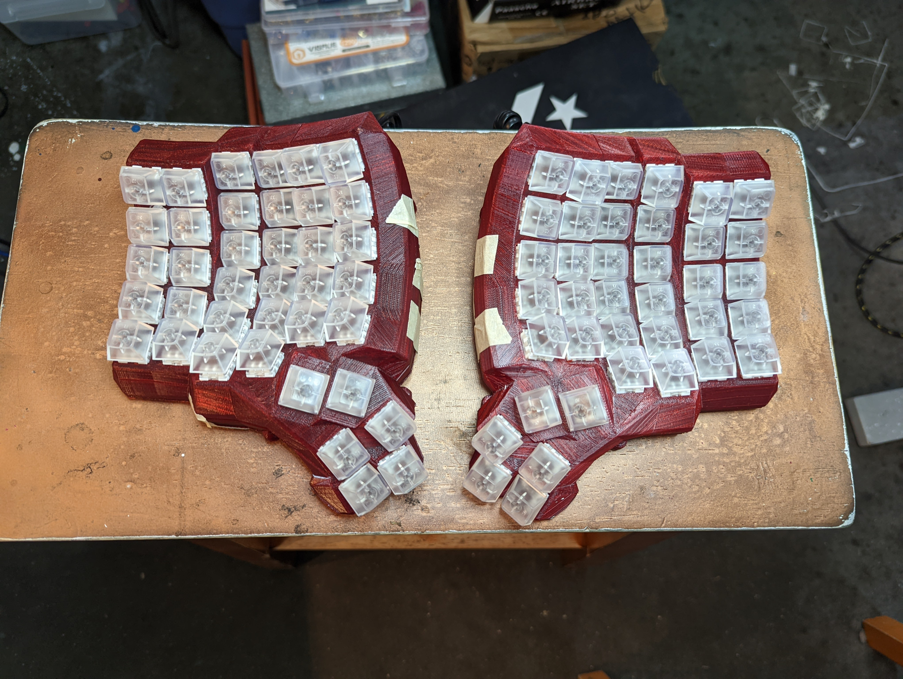

# Dactyl-Manuform 6x6

My Translucent Red DM6x6 keyboard with NeoPixels backlights. (Better pic of the LEDs coming soon)

## Parts
### Baseplate 3d Printed
* [Dactyl Manuform 6x6](https://thangs.com/designer/hepaestus/3d-model/Dactyl%20Manuform%206x6-75667)
### Microcontroller
* [Adafruit KB2040](https://www.adafruit.com/product/5302)
### Switches and Keycaps
* [Adafruit MX Brown](https://www.adafruit.com/product/4954)
* [Translucent MX Compatible Keycaps](https://www.adafruit.com/product/4956)
### Other Bits and Bobs
* [Momentary Switch]
* [2 RJ9 Connectors]
* [Adafruit Neopixels Strip]
* [Pro Micro/Arduino Breakout Board]()

