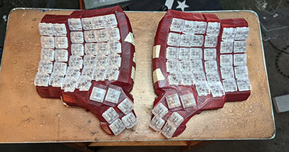
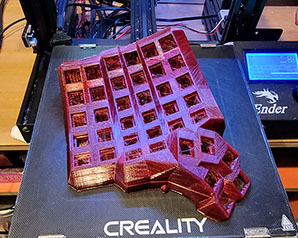
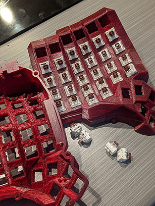
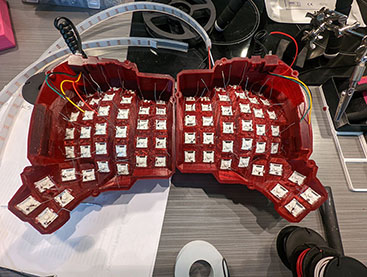
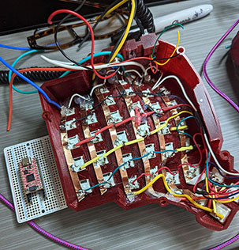
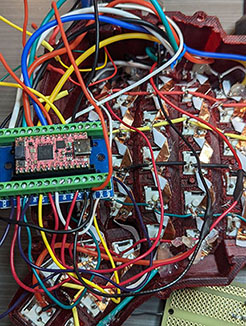

# Dactyl-Manuform 6x6
<picture style="margin: auto; ">
  
</picture>

Translucent Red DM6x6 keyboard with NeoPixels backlights. (Better pic of the LEDs coming soon)

Mainly Finished Circa: 2022-06-06 :)
### Current Progress On This Project
- [x] 3dPrint the Baseplate
- [x] Get all other parts together
- [x] Assemble the keyboard
- [x] Programm the keyboard
- [ ] Debug the Keyboard ( Current Status Debugging: 2022-06-06 :) )
- [ ] Fix the program
- [ ] Add Special Features
- [ ] Get RGB Leds working
- [ ] Learn to type on this new layout
- [ ] Hone the layout to my needs
- [ ] Use this keyboard regualrly as my daily driver


Project Coding Discussion
* [Discord Server](https://discord.gg/VtqKRwuec4)

## The Build
  
### Images












## Parts
### Baseplate 3d Printed
* [Dactyl Manuform 6x6](https://thangs.com/designer/hepaestus/3d-model/Dactyl%20Manuform%206x6-75667)
### Microcontroller
* [Adafruit KB2040](https://www.adafruit.com/product/5302)
    * Make sure you install the latest [Adafruit CircuitPython](https://circuitpython.org/board/adafruit_kb2040/)

### Switches and Keycaps
* [Adafruit MX Brown](https://www.adafruit.com/product/4954)
* [Translucent MX Compatible Keycaps](https://www.adafruit.com/product/4956)

### Other Bits and Bobs
* [Momentary Switch](https://www.amazon.com/dp/B09BKWMNJ9?)
* [2 RJ9 Connectors](https://www.amazon.com/gp/product/B093Q46KBZ/ref=ppx_yo_dt_b_search_asin_title?ie=UTF8&psc=1)
* [RJ9 Phone Cords](https://www.amazon.com/gp/product/B076J83H83/)
* [Adafruit Neopixels Strip](https://www.adafruit.com/product/1138?length=1)
* [Pro Micro/Arduino Breakout Board](https://www.amazon.com/dp/B0788MLRLK)
  * This made making changes **much** easier than unsoldering and resoldering.

## Code

### The Custom Keyboard Class
```python
## My Custom Keyboard Class
class DactylManuformKeyboard6x6(_KMKKeyboard):
    # create and register the scanner
    def __init__(self):      
        # create and register the scanner
        # Using Global variables as any null value passed, or not setting, causes errors in digitalio.py line 17
        #                            ROW PINS     COLUMN PINS  DIODES
        self.matrix = MatrixScanner( my_row_pins, my_col_pins, my_diode_orientation )
        
    def __repr__(self):
        return (
            '\n  DactylManuformKeyboard6x6( \n'
            '    debug_enabled = {}\n'
            '    diode_orientation = {}\n'
            '    matrix = {}\n'
            '    unicode_mode = {}\n'
            '    _hid_helper = {}\n'
            '    keys_pressed = {}\n'
            '    coordkeys_pressed = {}\n'
            '    hid_pending = {}\n'
            '    active_layers = {}\n'
            '    timeouts = {}\n'
            '    split_side = {}\n'
            '  )\n'
        ).format(
            self.debug_enabled,
            self.diode_orientation,
            self.matrix,
            self.unicode_mode,
            self._hid_helper,            
            self.keys_pressed,
            self._coordkeys_pressed,
            self.hid_pending,
            self.active_layers,
            self._timeouts,
            my_split_side,
        )
        
keyboard = DactylManuformKeyboard6x6()
```

### Your Unique Build

Notice this section of the code where the datapins are recorded. You need to specify the CircuitPython names for each cpin.
```python
## Wiring/Build Specific Configuration ##########################################
#
rgb_pixel_pin = board.D2
split_data_pin = board.D3
my_col_pins=[board.A2, board.A1, board.A0, board.SCK, board.MISO, board.MOSI, board.D10]
my_row_pins=[board.D4, board.D5, board.D6, board.D7, board.D8, board.D9]
my_diode_orientation=DiodeOrientation.COL2ROW
my_split_side=SplitSide.LEFT # DEFAULT TO LEFT SIDE
neopixels_per_side = 24
debugging_on=True
#
## End Build Config #############################################################
```

### Coord_Mapping

To figure out your coord_mapping multiply the number of cols and rows on each side of your keyboard or in your sinlge keboard matrix. For example I have 6 cols and 7. Multiply the cols and rows rto get the total number of connections possible per side 6x7 = 42. Each side has 42 posible keys. We are not using all the keys so you have to remove the key numbers you are not using from the matrix. 
Notice below the two sides MIRROR each other and that some numbers are skipped.

```python
keyboard.coord_mapping = [
     0, 1,  2,  3,   4,  5,    48, 47, 46, 45, 44, 43,
     6, 7,  8,  9,  10, 11,    54, 53, 52, 51, 50, 49,
    12, 13, 14, 15, 16, 17,    60, 59, 58, 57, 56, 55,
    18, 19, 20, 21, 22, 23,    66, 65, 64, 63, 62, 61,
    24, 25, 26, 27, 28, 29,    72, 71, 70, 69, 68, 67,
            32, 33, 34, 35,    78, 77, 76, 75,
            39, 40, 41, 42,    84, 83, 82, 81,
]    
```

### Keymaps and Layers
Below is a very simple 3 layer keymap for the 6x6.

```python
keyboard.keymap = [
    # QWERTY
    [    
        KC.F1,   KC.F2,  KC.F3,   KC.F4,   KC.F5,   KC.F6,        KC.F7,  KC.F8,   KC.F9,   KC.F10,  KC.F11,  KC.F12,
        KC.ESC,  KC.N1,  KC.N2,   KC.N3,   KC.N4,   KC.N5,        KC.N6,  KC.N7,   KC.N8,   KC.N9,   KC.N0,   KC.MINS,
        KC.TAB,  KC.Q,   KC.W,    KC.E,    KC.R,    KC.T,         KC.Y,   KC.U,    KC.I,    KC.O,    KC.P,    KC.EQL,
        KC.LSFT, KC.A,   KC.S,    KC.D,    KC.F,    KC.G,         KC.H,   KC.J,    KC.K,    KC.L,    KC.SCLN, KC.RSFT,
        KC.LCTL, KC.Z,   KC.X,    KC.C,    KC.V,    KC.B,         KC.N,   KC.M,    KC.COMM, KC.DOT,  KC.SLSH, KC.BSLASH,
                         KC.LCBR, KC.RCBR, KC.ENT,  KC.SPC,       KC.SPC, KC.RGUI, KC.HOME, KC.END, 
                         LOWER,   CUT    , KC.TAB,  KC.BSPC,      KC.DEL, PASTE  , KC.DEL,  RAISE,
    ],
    # LOWER
    [       
        _______, _______, _______, _______, _______, _______,     _______, _______, _______, _______, _______, _______,
        _______, XXXXXXX, XXXXXXX, XXXXXXX, XXXXXXX, XXXXXXX,     XXXXXXX, XXXXXXX, XXXXXXX, XXXXXXX, XXXXXXX, XXXXXXX,
        _______, XXXXXXX, KC.PGUP, KC.UP,   KC.PGDN, XXXXXXX,     XXXXXXX, XXXXXXX, XXXXXXX, XXXXXXX, XXXXXXX, XXXXXXX,
        _______, XXXXXXX, KC.LEFT, KC.DOWN, KC.RGHT, XXXXXXX,     XXXXXXX, XXXXXXX, XXXXXXX, XXXXXXX, XXXXXXX, XXXXXXX,
                          _______, _______, _______, _______,     _______, _______, _______, _______,
                          _______, _______, _______, _______,     _______, _______, _______, _______,
    ],
    #RAISE
    [       
        _______, _______, _______, _______, _______, _______,     _______, _______, _______, _______, _______, _______,
        _______, XXXXXXX, XXXXXXX, XXXXXXX, XXXXXXX, XXXXXXX,     XXXXXXX, XXXXXXX, KC.PSCR, KC.MUTE, KC.VOLU, KC.VOLD,
        _______, XXXXXXX, KC.PGUP, KC.UP,   KC.PGDN, XXXXXXX,     XXXXXXX, XXXXXXX, XXXXXXX, XXXXXXX, XXXXXXX, XXXXXXX,
        _______, XXXXXXX, KC.LEFT, KC.DOWN, KC.RGHT, XXXXXXX,     XXXXXXX, XXXXXXX, XXXXXXX, XXXXXXX, XXXXXXX, XXXXXXX,
                          _______, _______, _______, _______,     _______, _______, _______, _______,
                          _______, _______, _______, _______,     _______, _______, _______, _______,
    ],
]
```
### Module and Extensions
#### Extensions
RGB Extension Params

```python
rgb_ext = RGB(
    pixel_pin=rgb_pixel_pin,
    num_pixels=neopixels_per_side,
    val_limit=100,
    hue_default=100,
    sat_default=100,
    rgb_order=(1, 0, 2),  # GRB WS2812
    val_default=50,
    hue_step=5,
    sat_step=5,
    val_step=5,
    animation_speed=1,
    breathe_center=1,  # 1.0-2.7
    knight_effect_length=3,
    animation_mode=AnimationModes.STATIC,
    reverse_animation=False,
    refresh_rate=60
)
```
### Modules
Split Keyboard Module Params
```python
split_mod = Split(
    split_side=my_split_side,   
    split_flip=True, # If both halves are the same, but flipped, set this True
    split_type=SplitType.UART,  # Defaults to UART
    uart_interval=20,  # Sets the uarts delay. Lower numbers draw more power
    data_pin=split_data_pin,  # The primary data pin to talk to the secondary device
    #data_pin2=split_data_pin,  # Second uart pin to allow 2 way communication
    use_pio=True,  # allows for UART to be used with PIO
)
```

### Keyboard Left and Right Side Definitions
When your CIRCUITPYTHON Drive is loaded. Goto the properties for the drive and change the Name of the drive to LEFT.
Now plug in the right side of your keyboard and do the same on the CIRCUITPYHTON drive except this time name it RIGHT.

Now the code below will load the correct SplitSide to the Split Module
```python
## Figure Out Which Side I am On from the Mount Point.
name = str(getmount('/').label)
print('Keyboard Left Or Right: {}'.format(name))
if name == 'RIGHT':
     # right
     my_split_side=SplitSide.RIGHT
elif name == 'LEFT': 
     # left
     my_split_side=SplitSide.LEFT,    
else:
    print('ERROR: UNKNOWN DRIVE Cannot tell if right or left keyboard side')
```

